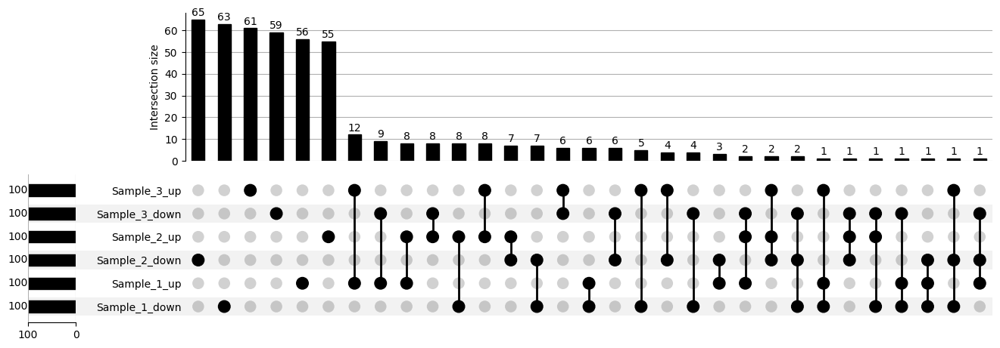

# UpSet Analysis of Simulated Differential Gene Expression
### Example Upset Plot


This repository provides a Python script to simulate differential gene expression data across multiple samples, prepare the data for UpSet analysis, export intersection tables, and visualize overlaps using an UpSet plot.

---

## Overview

UpSet plots are a powerful way to visualize intersections between multiple sets, such as genes up- or down-regulated across different experimental conditions. This script demonstrates the complete workflow, from data simulation to visualization and export.

---

## Example Input DataFrame Structure

The script expects a DataFrame where **each row represents a gene and the set it belongs to** (e.g., up/down-regulated in a sample). This is the structure used for UpSet analysis.

|   gene   |      set       |
|:--------:|:--------------:|
|  GENE123 | Sample_1_up    |
|  GENE456 | Sample_1_up    |
|  GENE789 | Sample_1_up    |
|  GENE123 | Sample_2_down  |
|  GENE555 | Sample_3_up    |
|  GENE789 | Sample_2_up    |
|  GENE789 | Sample_3_down  |
|   ...    |     ...        |

- **gene**: Gene symbol or identifier.
- **set**: The set this gene belongs to (combination of sample and regulation, e.g., `Sample_1_up`, `Sample_2_down`).

### How to Create This DataFrame with Your Own Data

If you have your own gene lists, you can construct this DataFrame as follows:

```python
import pandas as pd

# Example: Suppose you have these gene lists
sample_1_up = ['GENE123', 'GENE456', 'GENE789']
sample_2_down = ['GENE123', 'GENE999']
sample_3_up = ['GENE555']

# Build the DataFrame
all_sets = []
for gene in sample_1_up:
    all_sets.append({'gene': gene, 'set': 'Sample_1_up'})
for gene in sample_2_down:
    all_sets.append({'gene': gene, 'set': 'Sample_2_down'})
for gene in sample_3_up:
    all_sets.append({'gene': gene, 'set': 'Sample_3_up'})

df = pd.DataFrame(all_sets)
print(df)
```

---

## Workflow Steps

### 1. Simulate Differential Gene Expression Data

- **Purpose:** Generate example gene sets for demonstration.
- **Process:**
  - Creates a list of 1,000 fake human gene symbols (`GENE1` to `GENE1000`).
  - Defines three samples (`Sample_1`, `Sample_2`, `Sample_3`) and two regulation types (`up`, `down`).
  - For each sample and regulation type, randomly selects 100 genes (without replacement) to represent up- or down-regulated genes.
  - Stores these sets in a dictionary for further processing.

### 2. Prepare Data for UpSet Analysis

- **Purpose:** Structure the data for intersection analysis.
- **Process:**
  - Constructs a DataFrame where each row links a gene to a specific set (e.g., `Sample_1_up`).
  - Groups the DataFrame by gene, collecting all sets in which each gene appears.
  - Produces a Series mapping each gene to a tuple of set names, representing its "membership" across sets.

### 3. Build Intersection Table for Export

- **Purpose:** Summarize and export the intersections.
- **Process:**
  - Groups genes by their unique set-combinations (intersections).
  - For each intersection, counts the number of genes and lists their names.
  - Converts the tuple of sets into a comma-separated string for readability.
  - Saves this intersection summary as a CSV file: **`upset_membership_genes.csv`**.

### 4. UpSet Plot Visualization

- **Purpose:** Visualize the overlaps between gene sets.
- **Process:**
  - Counts the number of genes in each intersection.
  - Formats the data for the `upsetplot` library.
  - Generates and displays an UpSet plot, showing the size and composition of each intersection.

### 5. Output

- **CSV File:**  
  - **`upset_membership_genes.csv`**  
    | Column      | Description                                                |
    |-------------|------------------------------------------------------------|
    | `sets`      | Comma-separated list of up/down/sample combinations        |
    | `gene_count`| Number of genes in that intersection                       |
    | `genes`     | Semicolon-separated gene names in that intersection        |

- **Visualization:**  
  - An UpSet plot showing the overlap structure between all up/down sets across samples.

---

## Requirements

- Python 3.x
- [pandas](https://pandas.pydata.org/)
- [numpy](https://numpy.org/)
- [upsetplot](https://github.com/jnothman/UpSetPlot)
- [matplotlib](https://matplotlib.org/)

Install dependencies with:
```bash
pip install pandas numpy upsetplot matplotlib
```

---

## Usage

Run the script:

```bash
python your_script_name.py
```

This will generate the CSV file and display the UpSet plot.

---

## Full Script

```python
import pandas as pd
import numpy as np
from upsetplot import UpSet, from_memberships
import matplotlib.pyplot as plt

# ------------------------------------------------------------
# 1. Simulate Differential Gene Expression Data
# ------------------------------------------------------------

# Set random seed for reproducibility
np.random.seed(42)

# Generate a list of 1000 fake human gene symbols (GENE1, GENE2, ..., GENE1000)
all_genes = [f"GENE{i+1}" for i in range(1000)]

# Define sample names and regulation types
samples = ['Sample_1', 'Sample_2', 'Sample_3']
regulation = ['up', 'down']

# Create a dictionary to store up/down regulated genes for each sample
gene_dict = {}
for sample in samples:
    for reg in regulation:
        # For each sample and regulation, randomly select 100 genes (no replacement)
        gene_dict[f"{sample}_{reg}"] = set(np.random.choice(all_genes, size=100, replace=False))

# ------------------------------------------------------------
# 2. Prepare Data for UpSet Analysis
# ------------------------------------------------------------

# Create a DataFrame where each row is a (gene, set) pair
# This structure allows us to track which gene is present in which up/down set
all_sets = []
for set_name, genes in gene_dict.items():
    for gene in genes:
        all_sets.append({'gene': gene, 'set': set_name})

df = pd.DataFrame(all_sets)

# For each gene, collect all sets (up/down/sample) in which it appears
# Result: Series with index=gene, value=tuple of set names
memberships = df.groupby('gene')['set'].apply(lambda x: tuple(sorted(x)))

# ------------------------------------------------------------
# 3. Build Intersection Table for Export
# ------------------------------------------------------------

# Group by unique set-combinations (intersections)
# For each intersection, collect the genes and count them
intersection_df = (
    memberships
    .reset_index()
    .groupby('set')['gene']
    .agg(['count', lambda x: ';'.join(x)])
    .reset_index()
)
intersection_df.columns = ['sets', 'gene_count', 'genes']

# Convert the tuple of sets to a comma-separated string for readability
intersection_df['sets'] = intersection_df['sets'].apply(lambda x: ','.join(x))

# Save the intersection information to a CSV file
# Each row: intersection (sets), number of genes, gene names
intersection_df.to_csv('upset_membership_genes.csv', index=False)

# ------------------------------------------------------------
# 4. UpSet Plot Visualization
# ------------------------------------------------------------

# For plotting, we need the counts of each intersection
membership_counts = memberships.value_counts()

# Convert the intersection information into the format required by upsetplot
upset_data = from_memberships(membership_counts.index, data=membership_counts.values)

# Create and display the UpSet plot
# sort_by='cardinality' arranges intersections by descending size on the x-axis
UpSet(upset_data, show_counts=True, sort_by='cardinality').plot()
plt.show()

# ------------------------------------------------------------
# 5. Output
# ------------------------------------------------------------
# - 'upset_membership_genes.csv' contains:
#     * sets: intersection (comma-separated up/down/sample combinations)
#     * gene_count: number of genes in that intersection
#     * genes: semicolon-separated gene names in that intersection
# - An UpSet plot visualizing the overlaps between all up/down sets across samples

# ------------------------------------------------------------
# 6. Usage Notes
# ------------------------------------------------------------
# - Replace the simulated gene sets with your own gene lists for real data analysis.
# - The script is modular and can be easily adapted for more samples or different set names.
# - The output CSV is useful for downstream analysis or sharing with collaborators.
```

---

## Customization

- **Use your own gene lists:** Replace the simulated gene sets with your actual data for real analyses.
- **Adapt for more samples:** Add more sample or regulation types as needed.
- **Downstream analysis:** Use the output CSV for further exploration or sharing.

---

## License

MIT License (or specify your preferred license)

---

## Acknowledgments

- [UpSetPlot documentation](https://upsetplot.readthedocs.io/)
- [Original UpSet paper](https://www.nature.com/articles/nmeth.3252)

---

Feel free to modify this README for your specific project or audience!
